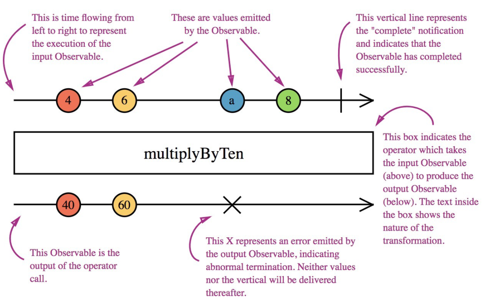

<details>
  <summary>
    Quick review
  </summary>
  
  
</details>

<details>
  <summary>
    Why Marble Tests?
  </summary>
  
  1.Marble testing has its own syntax
  2.Marble testing is a visual way to test Observables
  3.Easier to test, read and maintain
  4.Easier way to test code affecting time

</details>


<details>
  <summary>
    Character convention
  </summary>
  
  ```
    - (dash): simulate the passage of time, one dash correspond to a frame which can be perceived as 10ms in our tests, —--- is 40 ms
    
    a-z (a to z): represent an emission, -a--b---c stands for “emit a at 20ms, b at 50ms, c at 90ms”

    | (pipe): emit a completed (end of the stream), ---a-| stands for emit ‘a’ at 40ms then complete (60ms)

    # (pound sign): indicate an error (end of the stream), —--a--# emit a at 40ms then an error at 70ms

    ( ) (parenthesis): multiple values together in the same unit of time, —--(ab|) stands for emit a b at 40ms then complete (40ms)

    ^ (caret): indicate a subscription point, —^-- subscription starting at ^

    ! (exclamation point): indicate the end of a subscription point, —^--! subscription starting at ^ and ending at !
  ```
</details>

<details>
  <summary>
    Methods (for creating observables)
  </summary>
  
**cold()**

```
cold(marbles: string, values?: object, error?: any) 
```

Subscription starts when test begins:
cold(--a--b--|, { a: 'Hello', b: 'World' }) → Emit ‘Hello’ at 30ms and ‘World’ at 60ms, complete at 90ms.

**hot()**

```
hot(marbles: string, values?: object, error?: any) 
```

Behaves like subscription starts at point of caret:
hot(--^--a--b--|, { a: 'Hello', b: 'World' }) → Subscription begins at point of caret, then emit ‘Hello’ at 30ms and ‘World’ at 60ms, complete at 90ms.
</details>

<details>
  <summary>
    What is this sorcery?
  </summary>

  Marble diagrams are parsed, creating an observable that emits test message objects. The parsing step is done through the helper functions cold() and hot() .

  When parsed, the resulting object message has some specific properties.

  Test message object includes the values emitted, the frame at which thew were emitted, and the type of notification, including next, error, and complete. These objects will be tested by the expect clause in you tests.
  
  ```
  {
    “frame”: 10,
    ”notification”: {
      “kind”: ”N”,
      ”value”: ”a”,
      ”hasValue”: true
    }
  }
  ```

  Suddenly, this looking familiar 😁
  ```
    Expected [ Object({ frame: 10, notification: Notification({ kind: 'N', value: 0, error: undefined, hasValue: true }) }), Object({ frame: 10, notification: Notification({ kind: 'C', value: undefined, error: undefined, hasValue: false }) }) ] to equal [ Object({ frame: 10, notification: Notification({ kind: 'N', value: 0, error: undefined, hasValue: true }) }) ]
  ```
</details>


<details>
  <summary>
    Writing Tests
  </summary>
  
  [test examples](https://stackblitz.com/edit/jasmine-marbles-tests?file=src%2Fbasic.spec.ts)
</details>

