**Day 2**

<details>
  <summary>Marble Diagrams</summary>

  

  

  

  
</details>

---

<details>
  <summary>Op rundown</summary>

  <details>
  <summary>filter</summary>

  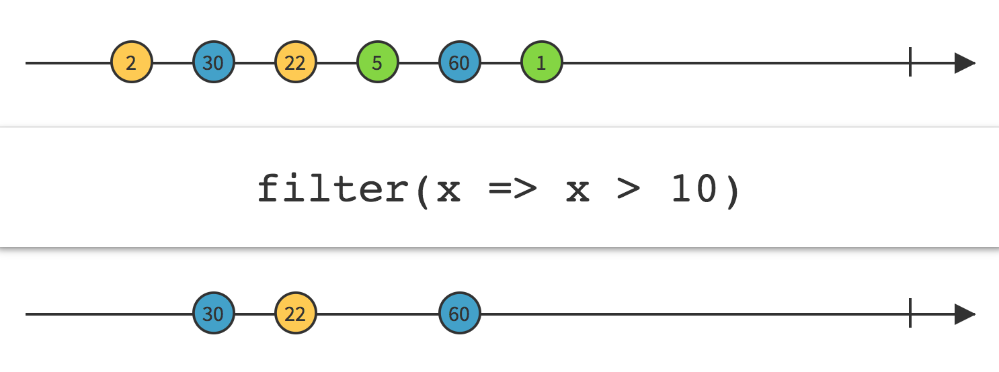
  ```
  import { fromEvent } from 'rxjs';
  import { filter } from 'rxjs/operators';

  const clicks = fromEvent(document, 'click');
  const clicksOnDivs = clicks.pipe(filter(ev => ev.target.tagName === 'DIV'));
  clicksOnDivs.subscribe(x => console.log(x));
  ```
    

  </details>

  <details>
  <summary>concat</summary>
  
  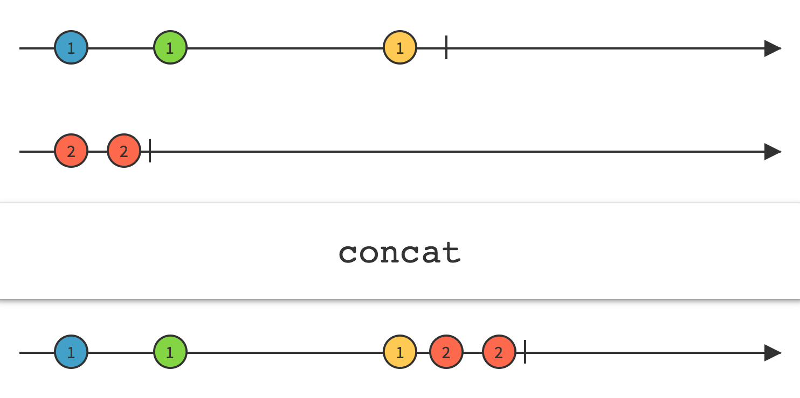
  ```
  import { concat, interval } from 'rxjs';
  import { take } from 'rxjs/operators';
  
  const timer1 = interval(1000).pipe(take(10));
  const timer2 = interval(2000).pipe(take(6));
  const timer3 = interval(500).pipe(take(10));
  
  const result = concat(timer1, timer2, timer3);
  result.subscribe(x => console.log(x));
  
  // results in the following:
  // (Prints to console sequentially)
  // -1000ms-> 0 -1000ms-> 1 -1000ms-> ... 9
  // -2000ms-> 0 -2000ms-> 1 -2000ms-> ... 5
  // -500ms-> 0 -500ms-> 1 -500ms-> ... 9
  ```

  </details>

  <details>
  <summary>map</summary>

  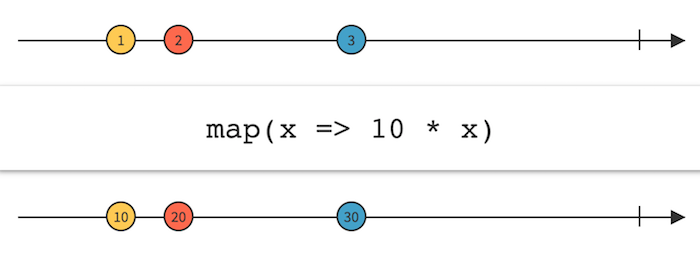
  ```
  import { fromEvent } from 'rxjs';
  import { map } from 'rxjs/operators';

  const clicks = fromEvent(document, 'click');
  const positions = clicks.pipe(map(ev => ev.clientX));
  positions.subscribe(x => console.log(x));
  ```
  </details>

  <details>
  <summary>switchMap</summary>

  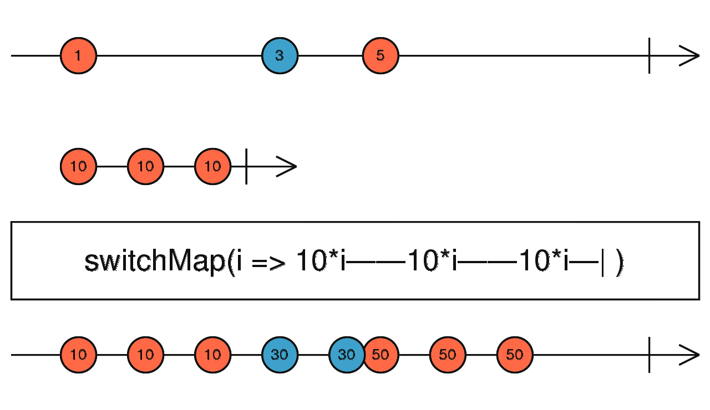

  ```
  import { of } from 'rxjs';
  import { switchMap } from 'rxjs/operators';
 
  const switched = of(1, 2, 3).pipe(switchMap((x: number) => of(x, x ** 2, x ** 3)));
  switched.subscribe(x => console.log(x));
  // outputs
  // 1
  // 1
  // 1
  // 2
  // 4
  // 8
  // ... and so on
  ```
  >Unsubscribes from each inner observable as the outer emits a new value
  </details>

  <details>
  <summary>flatMap aka mergeMap</summary>


  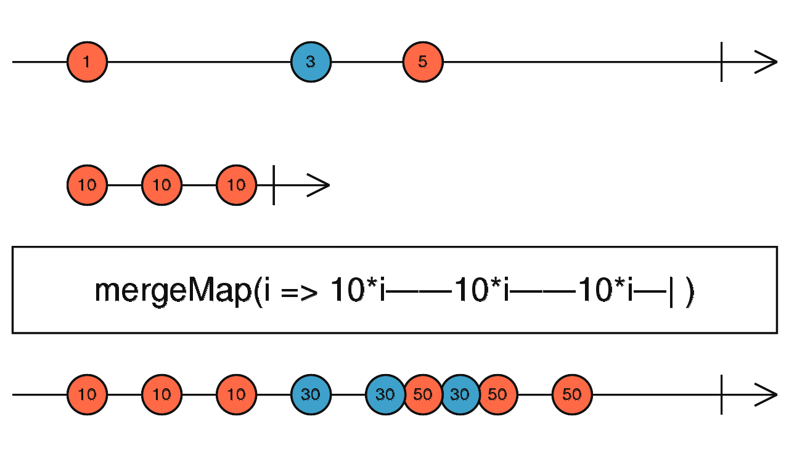
  ```
  import { of, interval } from 'rxjs';
  import { mergeMap, map } from 'rxjs/operators';
  
  const letters = of('a', 'b', 'c');
  const result = letters.pipe(
    mergeMap(x => interval(1000).pipe(map(i => x+i))),
  );
  result.subscribe(x => console.log(x));
  
  // Results in the following:
  // a0
  // b0
  // c0
  // a1
  // b1
  // c1
  // continues to list a,b,c with respective ascending integers
  ```
  >Maintains the subscription to the inner observable which can lead to interleaving of values on the flattened observable
  </details>


  <details>
  <summary>concatMap</summary>

  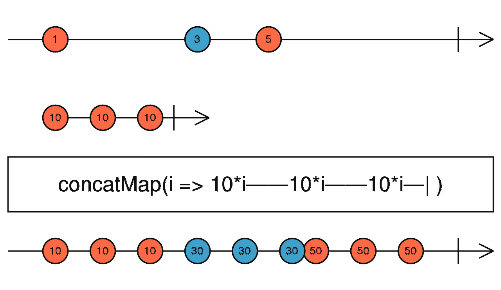
  ```
  import { fromEvent, interval } from 'rxjs';
  import { concatMap, take } from 'rxjs/operators';
  
  const clicks = fromEvent(document, 'click');
  const result = clicks.pipe(
    concatMap(ev => interval(1000).pipe(take(4)))
  );
  result.subscribe(x => console.log(x));
  
  // Results in the following:
  // (results are not concurrent)
  // For every click on the "document" it will emit values 0 to 3 spaced
  // on a 1000ms interval
  // one click = 1000ms-> 0 -1000ms-> 1 -1000ms-> 2 -1000ms-> 3
  ```

  >Maintains the subscription to the inner observable but waits for one to complete before subscribing to the other. This allows us to maintain order
  </details>


  <details>
  <summary>combineLatest</summary>
  
  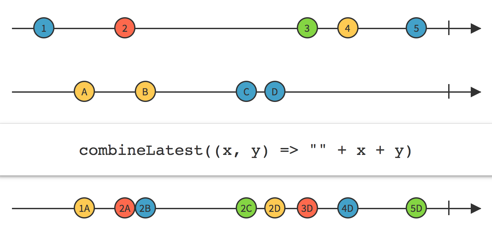
  ```
  import { combineLatest, timer } from 'rxjs';

  const firstTimer = timer(0, 1000); // emit 0, 1, 2... after every second, starting from now
  const secondTimer = timer(500, 1000); // emit 0, 1, 2... after every second, starting 0,5s from now
  const combinedTimers = combineLatest(firstTimer, secondTimer);
  combinedTimers.subscribe(value => console.log(value));
  // Logs
  // [0, 0] after 0.5s
  // [1, 0] after 1s
  // [1, 1] after 1.5s
  // [2, 1] after 2s
  ```
  </details>

  <details>
  <summary>forkJoin</summary>

  
  ```
  import { forkJoin, of } from 'rxjs';
  
  const observable = forkJoin([
    of(1, 2, 3, 4),
    Promise.resolve(8),
    timer(4000),
  ]);
  observable.subscribe({
  next: value => console.log(value),
  complete: () => console.log('This is how it ends!'),
  });
  
  // Logs:
  // [4, 8, 0] after 4 seconds
  // "This is how it ends!" immediately after
  ```

  </details>

  <details>
  <summary>zip</summary>

  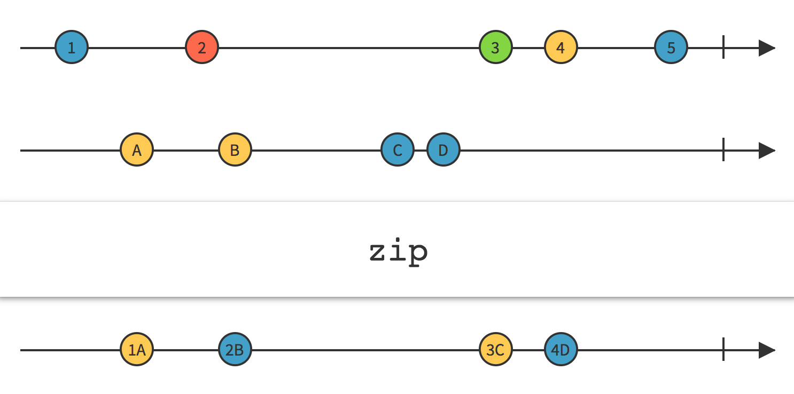
  ```
  import { zip, of } from 'rxjs';
  import { map } from 'rxjs/operators';
  
  let age$ = of<number>(27, 25, 29);
  let name$ = of<string>('Foo', 'Bar', 'Beer');
  let isDev$ = of<boolean>(true, true, false);
  
  zip(age$, name$, isDev$).pipe(
    map(([age, name, isDev]) => ({ age, name, isDev })),
  )
  .subscribe(x => console.log(x));
  
  // outputs
  // { age: 27, name: 'Foo', isDev: true }
  // { age: 25, name: 'Bar', isDev: true }
  // { age: 29, name: 'Beer', isDev: false }
  ```
  </details>

  <details>
  <summary>scan</summary>

  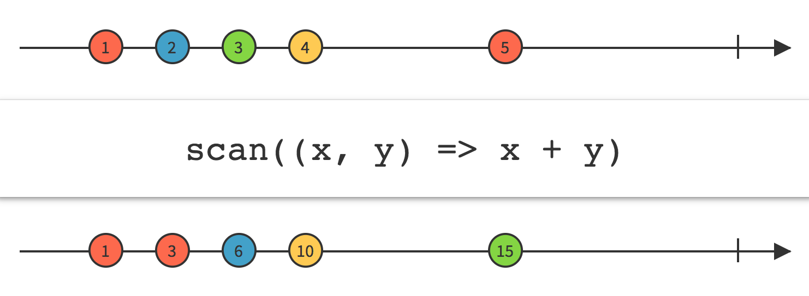
  ```
  import { fromEvent } from 'rxjs';
  import { scan, mapTo } from 'rxjs/operators';

  const clicks = fromEvent(document, 'click');
  const ones = clicks.pipe(mapTo(1));
  const seed = 0;
  const count = ones.pipe(scan((acc, one) => acc + one, seed));
  count.subscribe(x => console.log(x));

  // 1
  // 2
  // 3
  // 4...
  ```
  </details>

  <details>
  <summary>reduce</summary>

  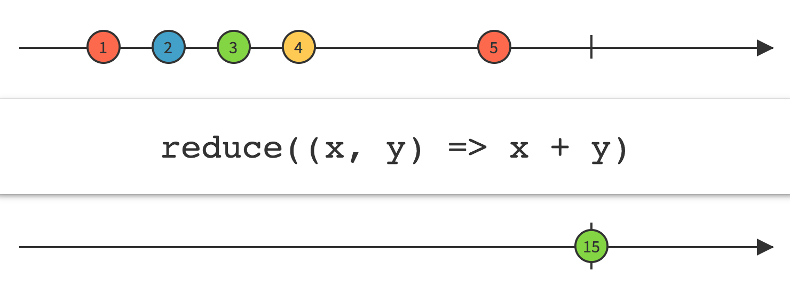
  ```
  import { fromEvent, interval } from 'rxjs';
  import { reduce, takeUntil, mapTo } from 'rxjs/operators';

  const clicksInFiveSeconds = fromEvent(document, 'click').pipe(
    takeUntil(interval(5000)),
  );
  const ones = clicksInFiveSeconds.pipe(mapTo(1));
  const seed = 0;
  const count = ones.pipe(reduce((acc, one) => acc + one, seed));
  count.subscribe(x => console.log(x));
  
  // the single value after 5 seconds
  ```
  </details>

  <details>
  <summary>debounce</summary>
    
  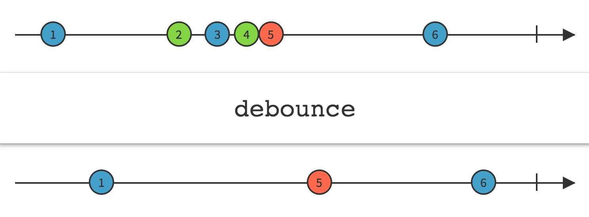
  ```
  import { fromEvent, interval } from 'rxjs';
  import { debounce } from 'rxjs/operators';

  const clicks = fromEvent(document, 'click');
  const result = clicks.pipe(debounce(() => interval(1000)));
  result.subscribe(x => console.log(x));
  ```
  </details>

  <details>
  <summary>distinct</summary>

  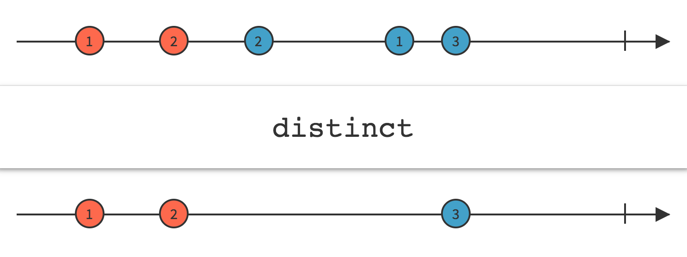
  ```
  import { of } from 'rxjs';
  import { distinct } from 'rxjs/operators';

  of(1, 1, 2, 2, 2, 1, 2, 3, 4, 3, 2, 1).pipe(
    distinct(),
  )
  .subscribe(x => console.log(x)); // 1, 2, 3, 4
  ```
  </details>

  <details>
  <summary>distinctUntilChanged</summary>

  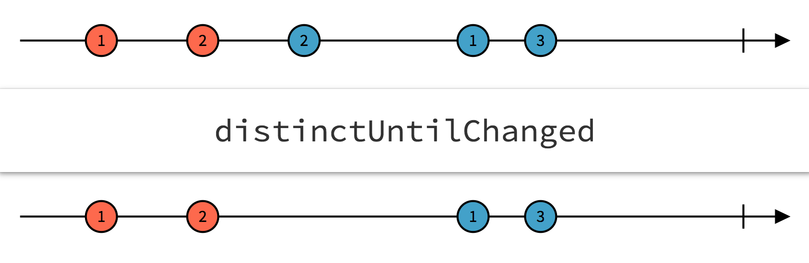
  ```
  import { of } from 'rxjs';
  import { distinctUntilChanged } from 'rxjs/operators';

  of(1, 1, 2, 2, 2, 1, 1, 2, 3, 3, 4).pipe(
    distinctUntilChanged(),
  )
  .subscribe(x => console.log(x)); // 1, 2, 1, 2, 3, 4
  ```
  </details>

  <details>
  <summary>takeUntil</summary>

  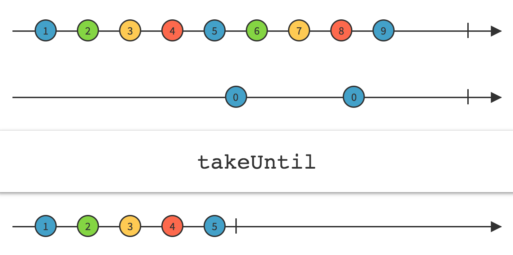
  ```
  import { fromEvent, interval } from 'rxjs';
  import { takeUntil } from 'rxjs/operators';

  const source = interval(1000);
  const clicks = fromEvent(document, 'click');
  const result = source.pipe(takeUntil(clicks));
  result.subscribe(x => console.log(x));
  ```
  </details>

  <details>
  <summary>tap</summary>
    
  >Perform a side effect for every emission on the source Observable, but return an Observable that is identical to the source.
  </details>
</details>

---
<details>
  <summary>How to: Real-time Viz</summary>

  <details>
  <summary>Starter Sandbox</summary>

  Starter: [citibike_exercise](https://codesandbox.io/s/get-it-to-work-citibike-hju02)
  
  Complete: 
  https://codesandbox.io/s/citi-bike-viz-fq2qg?fontsize=14&hidenavigation=1&theme=dark
  </details>

  <details>
  <summary>Endpoints</summary>

  >https://gbfs.citibikenyc.com/gbfs/en/station_information.json

  >https://gbfs.citibikenyc.com/gbfs/en/station_status.json
  </details>

  <details>
  <summary>Response Interface</summary>

  ```
  // Info Response -> Array<{
  station_id: string
  external_id: string
  name: string
  short_name: string
  lat: float
  lon: float
  region_id: int
  rental_methods: Array<methodObj>
  capacity: int
  rental_url: string
  electric_bike_surcharge_waiver: bool
  eightd_has_key_dispenser: bool
  eightd_station_services: Array<serviceObj>
  has_kiosk: bool
  }>
  ```
  </details>

  <details>
  <summary>Operator Hints</summary>
  
  - fromFetch
  - forkJoin
  - switchMap
  - map
  - tap
  - timer
  </details>


</details>

---

<details>
<summary>Resources</summary>

[rxmarbles](https://rxmarbles.com/)

[op docs](https://rxjs-dev.firebaseapp.com/api/operators)
</details>


